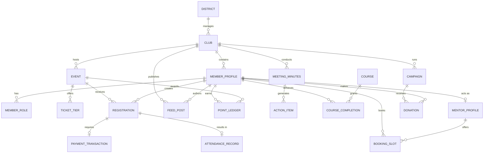

# L5 Architecture — Entity Relationship Architecture
### Rotaract District 3192 Web Portal

**Version:** 1.0  
**Last Updated:** 2026-07-01  
**Purpose:** To define the logical relationships, boundaries, and lifecycles of all business entities across the Rotaract District 3192 ecosystem.  
**Scope:** Covers all 17 modules defined in L4, focusing on domain-level relationships (logical ER), cardinality, aggregate roots, and transactional consistency.  
**Audience:** Principal Engineers, Backend Developers, Database Architects.  

---

## Table of Contents
1. [Cross References](#cross-references)
2. [Module Relationship Diagram](#module-relationship-diagram)
3. [Domain Relationship Diagram](#domain-relationship-diagram)
4. [Complete Logical ER Diagram](#complete-logical-er-diagram)
5. [Relationship Types & Cardinality](#relationship-types--cardinality)
6. [Aggregate Roots & Domain Boundaries](#aggregate-roots--domain-boundaries)
7. [Transaction Boundaries & Consistency Strategy](#transaction-boundaries--consistency-strategy)
8. [Relationship Ownership & Lifecycle](#relationship-ownership--lifecycle)
9. [Future Extensibility](#future-extensibility)
10. [Best Practices](#best-practices)

---

## Cross References
* **L1_Architecture_Overview:** System constraints and high-level service design.
* **L3_Data_Storage_Integrations:** Physical database constraints (PostgreSQL) and cold-line storage.
* **L4_Master_Entity_Catalogue:** Definition of the 17 business modules and core entities.

---

## Module Relationship Diagram

This diagram illustrates how the 17 core business modules interact at a macro level.

```mermaid
flowchart TD
    %% Define Modules
    Gov[1. District Governance]
    Club[2. Club Management]
    Mem[3. Member Profiles]
    Evt[4. Events & Ticketing]
    Att[5. Attendance]
    Pay[6. Payments & Dues]
    Gam[7. Gamification]
    Mom[8. MOMs & AI]
    LMS[9. Learning (LMS)]
    Feed[10. Social Feed]
    Ment[11. Mentorship]
    Jobs[12. Jobs]
    Res[13. Resources]
    Camp[14. Campaigns]
    Merc[15. Merchandise]
    Rep[16. Reporting]
    Bot[17. Automations & Bots]

    %% Macro Relationships
    Gov -->|governs| Club
    Club -->|aggregates| Mem
    Mem -->|interacts with| Evt
    Mem -->|interacts with| LMS
    Mem -->|interacts with| Ment
    Mem -->|interacts with| Jobs
    Mem -->|interacts with| Feed
    Club -->|hosts| Evt
    Club -->|runs| Camp
    Club -->|publishes| Res
    Club -->|conducts| Mom
    Evt -->|requires| Pay
    Evt -->|generates| Att
    Camp -->|requires| Pay
    Merc -->|requires| Pay
    Att -->|awards| Gam
    LMS -->|awards| Gam
    Mom -->|feeds| Rep
    Gam -->|feeds| Rep
    Evt -->|triggers| Bot
    Pay -->|triggers| Bot
```

**Why it exists:** To establish a clear dependency tree. The `Member Profiles` and `Club Management` modules act as the central hubs for almost all other modules. Understanding these macro dependencies prevents circular dependencies in the service layer.

---

## Domain Relationship Diagram

This diagram visualizes the primary domains: Core Identity, Operations, Finance, and Engagement.

```mermaid
graph LR
    subgraph Core Identity Domain
        District
        Club
        MemberProfile
    end

    subgraph Operations Domain
        Event
        AttendanceRecord
        MeetingMinutes
    end

    subgraph Finance Domain
        PaymentTransaction
        Campaign
        Order
    end

    subgraph Engagement Domain
        PointLedger
        FeedPost
        Course
    end

    Core Identity Domain -->|drives| Operations Domain
    Core Identity Domain -->|participates in| Engagement Domain
    Operations Domain -->|triggers| Finance Domain
    Operations Domain -->|updates| Engagement Domain
```

**Why it exists:** Bounded contexts help in splitting microservices (if needed in the future) or organizing mono-repo folder structures logically without overlap.

---

## Complete Logical ER Diagram

The following is a comprehensive logical Entity-Relationship (ER) diagram using Mermaid. Note that this models the *Domain*, not the physical SQL tables (e.g., ignoring standard audit columns for now).



---

## Relationship Types & Cardinality

### One-to-One Relationships (1:1)
* **`Registration` ↔ `PaymentTransaction`**
  * **Why it exists:** A user registers for an event. If the event is paid, a single distinct payment transaction must be securely tied to that specific registration.
* **`MemberProfile` ↔ `MentorProfile`**
  * **Why it exists:** Not all members are mentors, but a mentor is always exactly one member. This separates general member data from specific mentorship availability data.

### One-to-Many Relationships (1:N)
* **`Club` ↔ `MemberProfile` (1:N)**
  * **Why it exists:** A member officially belongs to one primary home club for dues and voting, while a club contains many members.
* **`Event` ↔ `Registration` (1:N)**
  * **Why it exists:** An event scales to hundreds of attendees, each generating a unique registration record.
* **`MeetingMinutes` ↔ `ActionItem` (1:N)**
  * **Why it exists:** A single meeting (MOM) produces multiple distinct tasks assigned to various individuals.

### Many-to-Many Relationships (M:N) via Junctions
* **`MemberProfile` ↔ `Course` (M:N) via `CourseCompletion`**
  * **Why it exists:** A member takes many courses; a course is taken by many members. The junction table (`CourseCompletion`) stores the timestamp and certificate URL.
* **`MemberProfile` ↔ `Event` (M:N) via `AttendanceRecord`**
  * **Why it exists:** Members attend multiple events. The junction (`AttendanceRecord`) captures the moment of check-in and method (QR vs Manual).

---

## Aggregate Roots & Domain Boundaries

An **Aggregate Root** is a primary entity that controls access and validates constraints for a cluster of child entities. 

1. **`Club` (Aggregate Root)**
   * **Children:** `MeetingMinutes`, `FeedPost`, `Campaign`, `ClubBranding`
   * **Boundary Rule:** You cannot delete a Club without cascading or reassigning its MOMs, posts, and campaigns.
2. **`MemberProfile` (Aggregate Root)**
   * **Children:** `MemberRole`, `PointLedger`, `CourseCompletion`
   * **Boundary Rule:** Points and Roles hold no meaning outside the context of the Member.
3. **`Event` (Aggregate Root)**
   * **Children:** `TicketTier`, `Registration`, `AttendanceRecord`
   * **Boundary Rule:** When an Event is canceled, its Tickets, Registrations, and pending Payments must be halted.

---

## Transaction Boundaries & Consistency Strategy

Because this is a high-volume, multi-tenant ecosystem, defining when to use strict Database Transactions versus Eventual Consistency is critical.

### Strict ACID Transactions (Synchronous)
Used when data integrity cannot tolerate even a millisecond of discrepancy.
* **Payments & Registrations:** Creating a `PaymentTransaction` and linking it to a `Registration` must happen in a single database transaction. If payment validation fails, the registration must roll back to avoid phantom tickets.
* **Action Items & MOMs:** Creating a `MeetingMinutes` record and its N `ActionItem` records happens transactionally.

### Eventual Consistency (Asynchronous)
Used for performance and scalability, where slight delays (seconds) are acceptable.
* **Leaderboard Updates:** When an `AttendanceRecord` is created, it emits an event. A background worker calculates the `PointLedger` and refreshes the `LeaderboardRanking` materialised view asynchronously.
* **Search Indexing & AI:** When a `MeetingMinutes` audio file is uploaded, the AI transcription runs asynchronously. The text is eventually reconciled with the record.

---

## Relationship Ownership & Lifecycle

### Ownership
* **Strong Ownership (Cascade Delete):** 
  If an `Event` is deleted, its `TicketTier`s are immediately deleted. The `Event` owns the tier entirely.
* **Weak Ownership (Soft Delete / Nullify):** 
  If a `MemberProfile` is deleted (e.g., GDPR/DPDP request), their `PaymentTransaction`s cannot be deleted due to financial audit laws. Instead, the `user_id` is nullified or anonymized.

### Lifecycle 
1. **Creation:** A child entity (e.g., `Registration`) cannot exist without validating the state of its parent (e.g., `Event` must be `Status = PUBLISHED`).
2. **Archival:** Records are rarely hard-deleted. Entities transition to a `status = 'ARCHIVED'` state. 
3. **Cold Storage:** After 2 years, `Event`, `Registration`, and `MeetingMinutes` data are migrated to cold storage, breaking active relational links in the hot PostgreSQL database but preserving them in analytical formats.

---

## Future Extensibility

* **Multi-District Support:** The architecture ensures every `Club` points to a `District`. While currently hardcoded to District 3192, this allows future horizontal scaling to other Rotary/Rotaract districts without schema redesign.
* **Clerk Auth Integration:** The `MemberProfile` entity is designed to map its primary key (`id`) directly to an external identity provider (like Clerk or Supabase Auth) via an `auth_id` column in the physical layer, decoupling business data from credential management.

---

## Best Practices

1. **Domain-Driven Design (DDD):** Always traverse the graph through Aggregate Roots. Do not manipulate `Registration` records without going through the `Event` context.
2. **No Orphaned Records:** Enforce Foreign Keys strictly in the physical layer (L6) to mirror these logical relationships.
3. **Idempotency in Finance:** Any relationships involving `PaymentTransaction` or `Donation` must support idempotent operations to handle duplicate webhook deliveries safely.

---
*This document defines the Logical ER structure. Proceed to L6 for the physical Database Dictionary and table-level specifics.*
