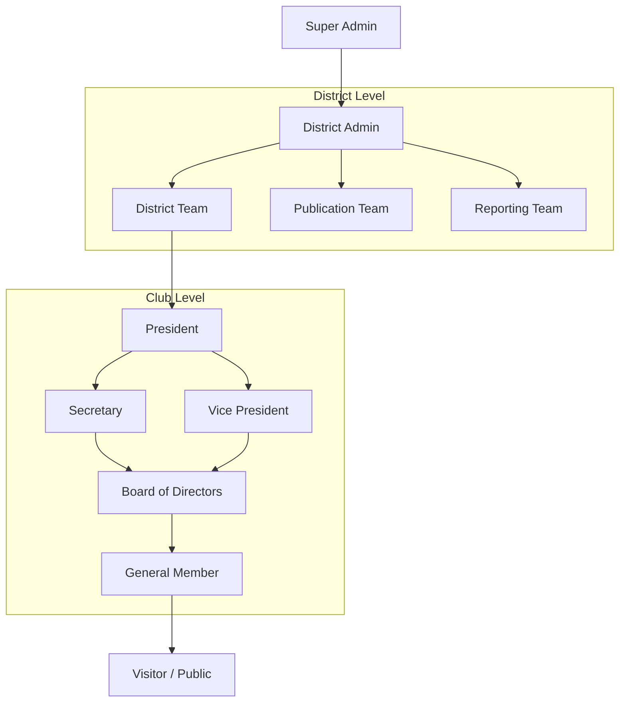

# L7 Architecture — RBAC & Permissions
### Rotaract District 3192 Web Portal

**Version:** 1.0  
**Last Updated:** 2026-07-01  
**Purpose:** To define the Role-Based Access Control (RBAC) strategy, encompassing roles, hierarchical inheritance, permission matrices, and row-level security implementation.  
**Scope:** Covers all 11 user roles across all 17 business modules, detailing exact privileges for operations such as Create, Read, Update, Delete, Approve, and Export.  
**Audience:** Security Engineers, Backend Developers, Product Managers.  

---

## Table of Contents
1. [Role Hierarchy & Inheritance](#role-hierarchy--inheritance)
2. [Role Definitions](#role-definitions)
3. [Permission Matrix](#permission-matrix)
4. [Access Flow](#access-flow)
5. [Future Clerk Integration](#future-clerk-integration)
6. [Future Supabase RLS Mapping](#future-supabase-rls-mapping)
7. [Security Best Practices](#security-best-practices)

---

## Role Hierarchy & Inheritance

The system utilizes a hierarchical permission model. Higher-level roles implicitly inherit the capabilities of the roles beneath them within their respective boundary (Club vs. District).



---

## Role Definitions

1. **Visitor:** Unauthenticated public user (e.g., viewing public Showcase).
2. **General Member:** Authenticated Rotaractor belonging to a specific Club.
3. **Board of Directors (BoD):** Club-level leaders (e.g., Club Service Director). Can manage specific events but not core club settings.
4. **Secretary:** Core club admin. Manages MOMs, reporting, and members.
5. **Vice President:** Acts as President in absence; manages club operations.
6. **President:** Ultimate authority over a single Club. Approves club budgets/campaigns.
7. **District Team:** District-level officials (e.g., District Rotaract Representative, Zonal Rotaract Representatives). Can view/manage clubs in their jurisdiction.
8. **Publication Team:** District team managing global newsletters, resources, and public relations content.
9. **Reporting Team:** District team managing compliance, audits, and data exports.
10. **District Admin:** Core IT/Admin team managing global settings, district events, and dispute resolution.
11. **Super Admin:** System owners (Developers/Tech Chair) with raw database access and bypass capabilities.

---

## Permission Matrix

*Legend:*
* **✓** = Allowed (Global)
* **[Self]** = Allowed for own records only
* **[Club]** = Allowed for own Club's records only
* **—** = Denied

### Module: Club Operations & Member Profiles
| Role | Read | Create | Update | Delete | Archive | Export |
|------|------|--------|--------|--------|---------|--------|
| Visitor | ✓ | — | — | — | — | — |
| General Member | ✓ | — | [Self] | — | — | — |
| Secretary / VP | ✓ | [Club] | [Club] | — | [Club] | [Club] |
| President | ✓ | [Club] | [Club] | — | [Club] | [Club] |
| District Admin | ✓ | ✓ | ✓ | ✓ | ✓ | ✓ |

### Module: Events & Ticketing
| Role | Read | Create | Update | Delete | Approve | Publish | Feature |
|------|------|--------|--------|--------|---------|---------|---------|
| Visitor | ✓ | — | — | — | — | — | — |
| General Member | ✓ | — | — | — | — | — | — |
| BoD | ✓ | [Club] | [Club] | — | — | [Club] | — |
| Secretary / Pres | ✓ | [Club] | [Club] | [Club] | [Club] | [Club] | — |
| District Admin | ✓ | ✓ | ✓ | ✓ | ✓ | ✓ | ✓ |

### Module: MOMs, Reporting & Analytics
| Role | Read | Create | Update | Delete | Analytics | Bulk Actions | Export |
|------|------|--------|--------|--------|-----------|--------------|--------|
| General Member | — | — | — | — | — | — | — |
| Secretary / Pres | [Club] | [Club] | [Club] | — | [Club] | [Club] | [Club] |
| Reporting Team | ✓ | — | — | — | ✓ | — | ✓ |
| District Admin | ✓ | ✓ | ✓ | ✓ | ✓ | ✓ | ✓ |

### Module: Campaigns & Crowdfunding (Finance)
| Role | Read | Create | Update | Delete | Approve | Archive |
|------|------|--------|--------|--------|---------|---------|
| Visitor | ✓ | — | — | — | — | — |
| BoD | ✓ | [Club] | [Club] | — | — | — |
| President | ✓ | [Club] | [Club] | — | [Club] | [Club] |
| District Admin | ✓ | ✓ | ✓ | — | ✓ | ✓ |

*(Note: Deletion of financial records is globally denied except for Super Admin in edge cases).*

---

## Access Flow

### Request Lifecycle
1. **Authentication:** User logs in via frontend. Token is generated.
2. **Gateway/Middleware:** The Backend/Supabase receives the request. The token is parsed to extract `user_id` and `role`.
3. **Role Validation:** The system checks if the `role` is permitted to execute the requested action (e.g., `CREATE_EVENT`).
4. **Boundary Validation (Row Level):** The system checks if the resource belongs to the user's boundary. (e.g., "Is `Event.club_id` equal to `User.club_id`?").
5. **Execution:** Database transaction commits.
6. **Audit:** Action is logged in an audit trail (who, what, when).

---

## Future Clerk Integration

When transitioning to **Clerk** for Authentication:
1. **JWT Custom Claims:** Clerk will be configured to inject the user's Rotaract `role` and `club_id` directly into the session JWT (`__session` cookie).
   ```json
   {
     "sub": "user_2P...",
     "metadata": {
       "role": "President",
       "club_id": "uuid-1234..."
     }
   }
   ```
2. **Decoupling:** The Node.js/Next.js backend will decode the Clerk JWT to authorize API routes without querying the database for the user's role on every request, vastly improving performance.
3. **Syncing:** A Clerk Webhook (`user.updated`) will sync profile data (email, name) down to the PostgreSQL `member_profiles` table.

---

## Future Supabase RLS Mapping

If bypassing the Node.js API layer and utilizing Supabase directly from the frontend, **Row Level Security (RLS)** will be enforced strictly in PostgreSQL.

**Example RLS Policy on `events` table:**
```sql
-- Allow anyone to read PUBLISHED events
CREATE POLICY "Public can view published events" 
ON public.events FOR SELECT 
USING (status = 'PUBLISHED');

-- Allow Club Presidents and Secretaries to UPDATE their own club's events
CREATE POLICY "Club Admins can update own events"
ON public.events FOR UPDATE
USING (
  auth.uid() IN (
    SELECT id FROM member_profiles 
    WHERE club_id = events.club_id 
    AND role IN ('President', 'Secretary')
  )
);
```
**RLS Strategy:**
* By default, `ENABLE ROW LEVEL SECURITY` on all tables.
* Define `SELECT`, `INSERT`, `UPDATE`, and `DELETE` policies for every table mimicking the Permission Matrix above.

---

## Security Best Practices

1. **Principle of Least Privilege:** Users are granted the lowest tier role necessary. District Team roles should be assigned sparingly.
2. **Impersonation Auditing:** If a Super Admin utilizes a "Login As User" feature for debugging, this session must be flagged, and all audit logs must record the *actual* acting admin's ID alongside the impersonated user's ID.
3. **Separation of Duties:** Financial campaigns (Crowdfunding) created by a Club President must still be approved by a District Admin before going live to the public.
4. **Rate Limiting by Role:** Visitors and General Members face stricter API rate limits than District Admins to prevent scraping or DoS attacks on public endpoints.
5. **Secure Defaults:** If an RLS policy or JWT claim is missing or evaluates to `NULL`, the system must default to `DENY`.

---
*This document defines the Role-Based Access Control matrix. Proceed to L8 for the API Contracts mapping these permissions to endpoints.*
