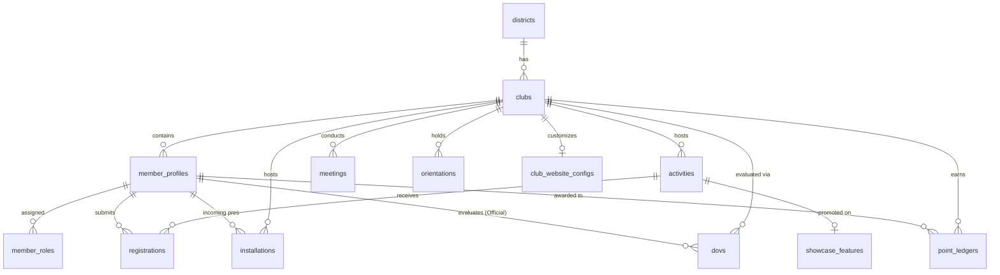

# Relationship Diagram
### Rotaract District 3192 Web Portal

This document visualizes the database relationships across the newly expanded modules for Sprint 2.2.

## Global Entity-Relationship Diagram



## Module Dependencies Graph

```mermaid
flowchart TD
    Org[Organization] --> Ident[Identity]
    Org --> Web[Website Builder]
    
    Ident --> Ops[Club Operations: Meetings, DOVs, Orientations]
    Org --> Ops
    
    Org --> Act[Activities]
    Ident --> Act
    
    Act --> Show[Public Showcase]
    
    Ops --> AI[AI Module (Transcripts)]
    Ops --> Lead[Leaderboards]
    Act --> Lead
    
    Sys[System] --> Notif[Notifications]
    Sys --> Analytics[Analytics]
    Sys --> Admin[Administration / Audit]
```

## Bounded Context Boundaries

* **Operations Bounded Context:** Encompasses `meetings`, `orientations`, `installations`, and `dovs`. All of these strictly depend on a `club_id`.
* **Identity Bounded Context:** `member_profiles` relies directly on a Supabase Auth `user_id`. Everything revolves around this profile.
* **Analytics & System Bounded Context:** `analytics_events` and `audit_logs` are isolated ledgers that reference other entities globally but are never directly mutated by standard business logic (append-only).
